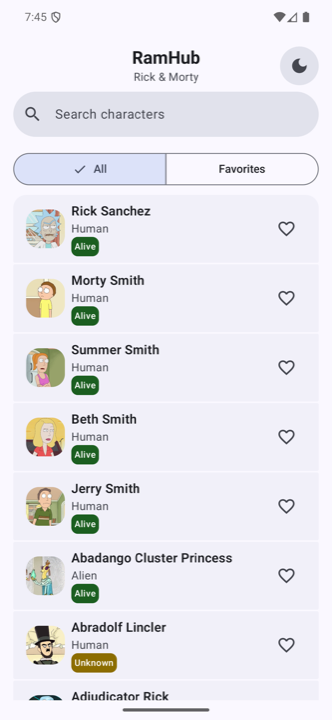
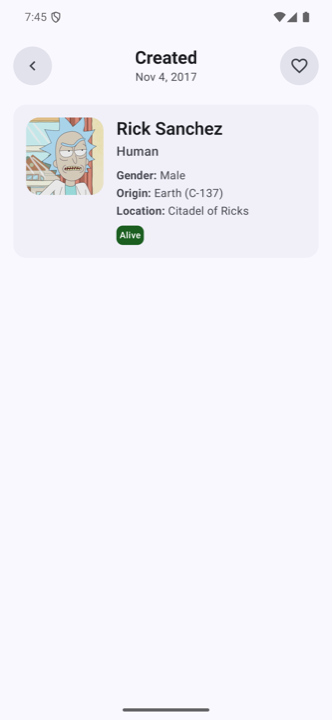
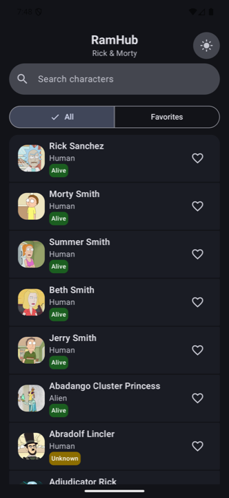
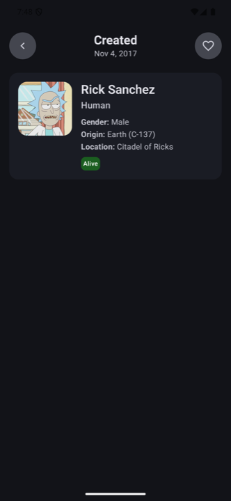

# RamHub — GM-Challenge

Repositorio del challenge de Grupo Mariposa.  
App Android que explora personajes de Rick & Morty, con búsqueda, favoritos y modo oscuro.

## 🚀 Instalación y ejecución

### Requisitos

|                        |                                                                      |
|------------------------|----------------------------------------------------------------------|
| **Android Studio**     | Ladybug o superior                                                   |
| **JDK**                | 25 (toolchain automático vía Foojay, no requiere instalación manual) |
| **Internet**           | API pública de Rick and Morty — sin API key                          |
| **minSdk / targetSdk** | 24 (Android 7.0) / 37                                                |

### Pasos

1. Clonar el repo y abrirlo en Android Studio.
2. Sincronizar Gradle (el wrapper descarga Gradle 9.5 automáticamente).
3. Ejecutar la configuración `app` en un emulador o dispositivo con Android 7.0+.

O por línea de comandos:

```bash
./gradlew :app:installDebug
```

### Tests

```bash
./gradlew test                    # unitarios
./gradlew connectedAndroidTest    # instrumentados (requiere emulador/dispositivo)
```

> **Nota:** desarrollado y probado principalmente en un Redmi Note 9 Pro (MIUI, Android 10).

## 🏛️ Arquitectura

El proyecto sigue **Clean Architecture**, separando en capas cuando aplica (no todos los módulos
necesitan las tres):

```
domain  → Modelos, casos de uso y contratos (interfaces).
data    → Implementación de esos contratos: repositorios, mappers y fuentes de datos (Room, Retrofit, DataStore, Paging).
ui      → Archivos que representan la interfaz de usuario de la app: vistas con Compose, ViewModels, Activities, navegación, etc.
```

Es **offline-first**: Room es la única fuente de verdad (single source of truth) para la UI. Un
`RemoteMediator` de Paging3 se activa cuando la lista necesita más datos (carga inicial, scroll o
pull-to-refresh), consulta la API y escribe el resultado en Room.

La capa **ui** usa **Jetpack Compose con MVVM** y un patrón **Coordinator + Actions**: el
`Coordinator` expone el estado y las interacciones con el `ViewModel`, y además resuelve la
navegación (ej. al hacer click en un personaje). `Actions` agrupa esas interacciones como lambdas
para cada composable. Así la UI queda desacoplada de Hilt/ViewModel — más fácil de previsualizar y
testear.

## 🏗️ Estructura del proyecto

```
GM-Challenge
├── app     → Módulo principal de la aplicación.
├── core    → Módulo que contiene el núcleo de la aplicación: base de datos y servicios web.
└── common  → Módulo que contiene vistas, clases y métodos reutilizables.
```

Detalle de cada módulo:

```
app
├── domain  → Modelos, casos de uso y contratos.
├── data    → Implementación de esos contratos: repositorios, mappers, paginación.
├── ui      → Vistas Compose, ViewModels, Activities y navegación.
└── di      → Módulos de Hilt para inyectar dependencias del módulo.

core
├── data/local   → Base de datos Room: entidades y DAOs.
├── data/remote  → Cliente Retrofit: API y DTOs.
└── di           → Módulos de Hilt para red, base de datos y DataStore.

common
├── ui/theme       → Colores, tipografía y dimensiones (design system).
├── ui/components  → Componentes Compose reutilizables.
└── utils          → Extensiones y utilidades compartidas.
```

## 🔧 Decisiones técnicas

| Decisión                                                                                        | Por qué                                                                                                                                                                                                                                         |
|-------------------------------------------------------------------------------------------------|-------------------------------------------------------------------------------------------------------------------------------------------------------------------------------------------------------------------------------------------------|
| Favoritos en tabla separada (`FavoriteEntity`, join con `characters`)                           | Paging3 invalida por tabla completa; si favoritos fuera una columna de `characters`, cada toggle recargaría toda la lista paginada.                                                                                                             |
| Campo `nameNormalized` para las búsquedas                                                       | SQLite no ignora acentos ni mayúsculas de forma nativa; se guarda el nombre sin acentos/en minúsculas y se compara contra el término buscado normalizado igual. Así "sanchez" encuentra "Sánchez".                                              |
| Pull-to-refresh con un flag + `refresh()` de Paging3                                            | Paging3 no tiene forma nativa de decirle al `RemoteMediator` que borre todo antes de la próxima carga; un flag simple resuelve un refresh limpio.                                                                                               |
| DataStore en vez de SharedPreferences (tema)                                                    | Expone la preferencia como `Flow`, observable reactivamente desde Compose sin código de bridging extra.                                                                                                                                         |
| Filtro Todos/Favoritos con `SegmentedButton`, no tabs ni pantalla aparte                        | Es el mismo `Pager` filtrado por `favoritesOnly`; una pantalla aparte o un `TabRow` duplicarían la lista sin necesidad, mientras el `SegmentedButton` resuelve el filtro binario en una sola vista.                                             |
| Contenido scrolleable en todas las pantallas, no layouts aparte para landscape/pantallas chicas | La lista (`LazyColumn`) y el detalle (`Column` con scroll) dejan que el contenido se desplace verticalmente en vez de recortarse; así la app se adapta a pantallas más chicas o en landscape sin diseñar una variante de layout para cada caso. |
| Clases base para lógica compartida (`BaseFavoritesViewModel`) y vistas reutilizables (`common`) | `ListViewModel` y `DetailViewModel` necesitan la misma lógica de favoritos (observar ids, hacer toggle), y ambas pantallas comparten elementos de UI (barras, botones, filas); centralizarlos evita duplicar código entre pantallas.            |
| Tests instrumentados para Room, no Robolectric                                                  | Corren contra SQLite y Android reales, más confianza que un shadow.                                                                                                                                                                             |

## ⚖️ Trade-offs

| Trade-off                                              | Detalle                                                                                                                                                                                                                                                |
|--------------------------------------------------------|--------------------------------------------------------------------------------------------------------------------------------------------------------------------------------------------------------------------------------------------------------|
| La búsqueda solo encuentra personajes ya cacheados     | No consulta la API por nombre; un personaje que aún no se descargó (por scroll) no aparece hasta que el `RemoteMediator` lo traiga. Se prioriza un solo `Pager` remoto sobre cobertura completa de búsqueda.                                           |
| `compileSdk`/`targetSdk` 37 con AGP 9.3.2 y Gradle 9.5 | Da acceso a las APIs y el tooling más recientes, a costa de más riesgo de bugs que usar versiones estables.                                                                                                                                            |
| No usar FTS4/FTS5 para las búsquedas                   | Room lo soporta con el tokenizer `unicode61` y su opción `remove_diacritics`, que resolvería el tema de acentos de forma nativa; para un dataset tan chico (~800 personajes) no justificaba la complejidad de mantener esa tabla virtual sincronizada. |
| Los tests instrumentados no corren en el CI actual     | No se incluyeron por cuestiones de tiempo de ejecución; solo se validan localmente contra un emulador/dispositivo.                                                                                                                                     |

## 📱 Capturas

|            | Lista                                                                                     | Detalle                                                                                       |
|------------|-------------------------------------------------------------------------------------------|-----------------------------------------------------------------------------------------------|
| **Claro**  |        |         |
| **Oscuro** |  |  |